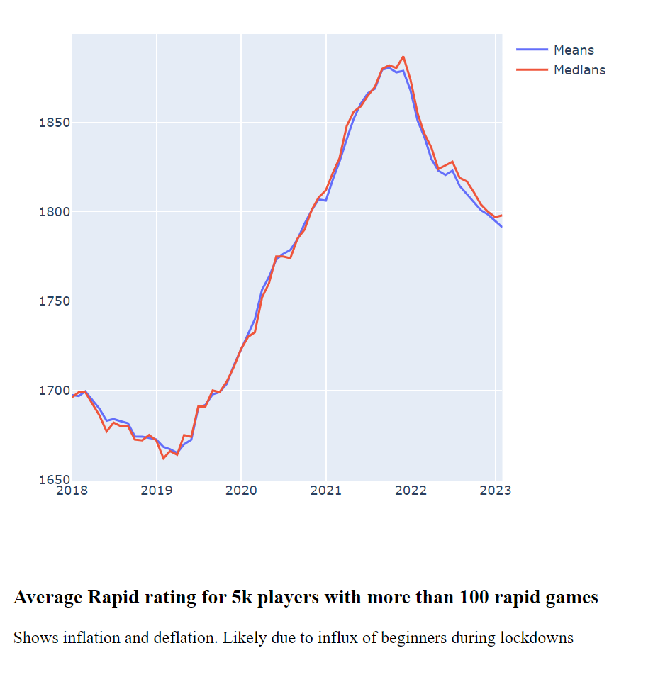
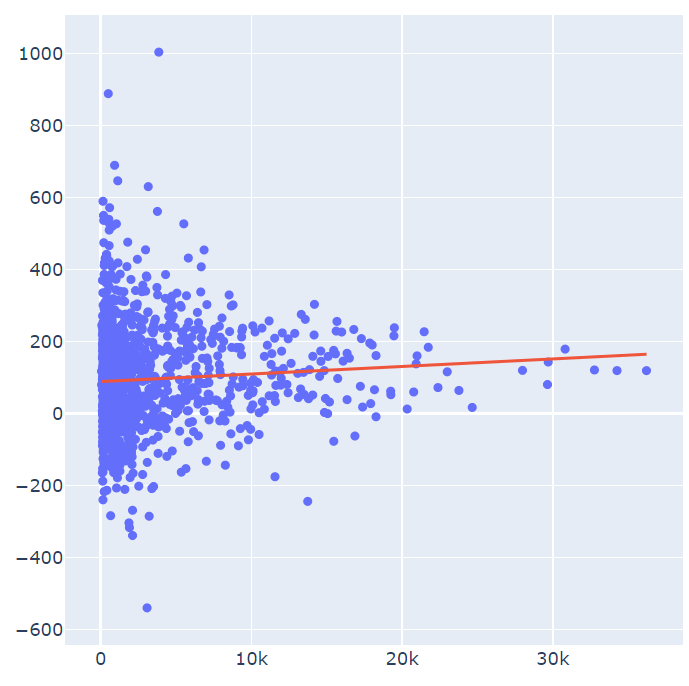

# Whats this? 

A "work in progress" to try and discover if players of online chess improve, and what do the ones who improve do. 
Having played a lot of online chess myself, and found improving my rating to be pretty tricky, I wondered if most people are actually getting better. 

Chess improvement is a huge field and focuses on things like opening theory. Books, videos, and blogs try to analytically prove that the properties of a particular opening or strategy will give an advantage. But its very hard to know what works - particularly for players of different standards. 

It also unclear whether regularly changing your opening will be beneficial. It could deepen a players understanding or it might be better to stay focused on one opening and learn it inside out. 

Lichess has a fairly open api with game and rating histories for all players, so it's now possible to take a purely empirical approach to chess improvement. 
Instead of asking, "How do I improve", we can ask "What do players who improve do?".

# Approach 
First I downloaded a backup of all the games played in the month of October 2015. This is available [here](https://database.lichess.org/)
Then I extracted all the games from the lichess_db_standard_rated_2015-02.pgn file in the back up using ParsePGN.fsx. I am only analysing "Rapid" games, but code could easily include other time controls. Results of parsing the pgn are saved to csv format. Only the game headers, including results and opening codes are saved, the moves are not needed as I don't plan to analyse these. 

The players usernames are extracted from this csv and filtered to exclude players with less than 100 rapid games and who havn't played a game in the last 30 days. The resulting list is saved into the playercohort.csv.

Using the SavePlayerRatings.fsx we then query the lichess API and get the rapid rating history for each player in the cohort file. 
These are averaged monthly for each player and stored in the playerRating.csv file.

# Rating change
We are then able to calculate the rating change for each player from 2015 until now. 

That gives the following histogram.

Viewing it as a probability distribution makes clear that most players have little chance of substantial improvement. Over 7 years of pretty active play you have a 60 percent chance of a 100 point improvement. A 350 point improvement is about half a percent chance. So my meager gains are not so bad after all. 

The picture is muddied by the rating deflation/inflation happening with Lichess as a whole. The chart below shows how the average (median and mean) rating has flutuated since 2018. This is likely due to a large influx of beginners during the covid lockdowns who provided fresh points for those higher up the food chain. 

Code to generate these graphs, as well as density functions and a cumulative probability chart, are in Analytics\ChartRatingGains.fsx

# Drivers of rating increase

## Play more?
First and obvious thing to check was whether simply playing more games would improve rating.
Chart below shows least squares regression for rating change over number of games.
Each dot is a player, x axis is number of game played since 2015, y axis is rating change.
The regression line does show some benefit to playing lopts of games but not much.

Code to generate this is in Analytics\AnalysePlayersGames.fsx

## Switch openings often?

1. Downloaded Lichecss DB from October 2015
2. All games are extracted from DB into CSV using ParsePGN.fsx
3. Player list is extracted from games csv using LichessArchive module  
4. PlayerCohort.fsx gets players and saves active ones in new playercohort.csv
5. Players in playercohort.csv have rating history queried from lichess and stored in playerrating csv
6. Player ratings are averaged monthly and then rating changed since 2015 is calucalted.
7. Histogram of rating change is show and percentile distribution.
8. ImportGames is used to import the game headers of all players in the file provided like so 
dotnet run  "../data/2023-1-07--13-41-41-playercohort.csv" --release
The idea is to look at the opening classifciation and see if there is any pattern between rating change and opening choice.

